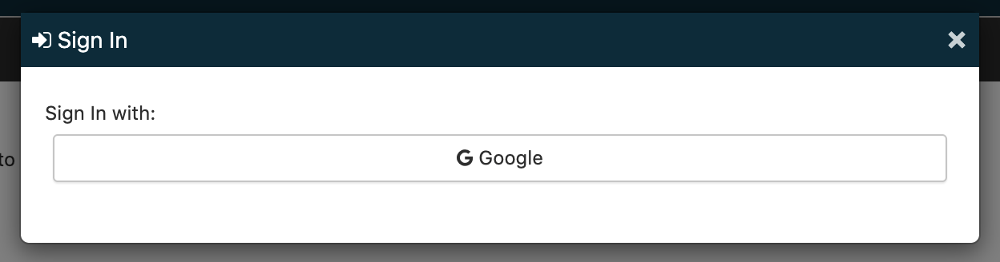
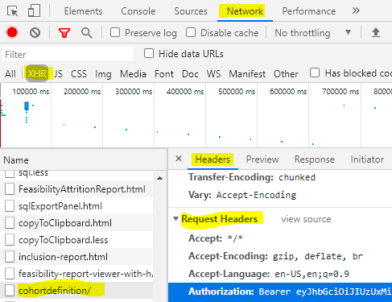

```{r, include = FALSE}
knitr::opts_chunk$set(
  collapse = TRUE,
  comment = "#>"
)

# Note: This vignette simulates interaction with a WebAPI endpoint for 
# demonstration purposes but is written so that it can be rendered to html
# without relying on any external resources like a WebAPI endpoint.
```

```{css echo=FALSE}
h1  {
  margin-top: 60px;
}
```

It is common for Atlas and WebAPI to have an authentication/authorization layer. 
Using ROhdsiWebApi with a security-enabled WebAPI instance requires a special 
security token to be sent along with any WebAPI request. This token is known as
a bearer token and is created anytime a user logs in to Atlas. 

The first step in using ROhdsiWebApi with security-enabled instance of 
Atlas/WebAPI is to identify which type of authentication is being used.

Commonly used options are

1. Active Directory
2. Database: An internal WebAPI database table stores usernames and passwords
3. Windows
4. Google (OAuth2)


If you attempt to use ROhdsiWebApi on a security-enabled WebAPI instance without
first authenticating you will see an http 401 error.

```{r, eval=FALSE}
library(ROhdsiWebApi)
baseUrl <- "https://yourSecureAtlas.ohdsi.org/"
getCdmSources(baseUrl)
```
```{r, error=TRUE, echo=FALSE}
stop("Error: http error 401: Unauthorized request. Try running `authorizeWebAPI()`")
```

Supported login types will be visible on the ATLAS platform sign in page:



# Active Directory, Windows and database authentication

If you typically log in to Atlas using a username and password then WebAPI is likely
using either Active Directory or database authentication. In this case it is 
easy to authorize ROhdsiWebApi by calling the `authorizeWebAPI()` function.


```{r, eval=FALSE}
authorizeWebApi(baseUrl, 
                authMethod = "db", 
                webApiUsername = Sys.getenv("WEBAPI_USERNAME"), 
                webApiPassword = Sys.getenv("WEBAPI_PASSWORD"))

```

This function does not return a value but instead has a side effect of retrieving the 
bearer token from WebAPI and saving it in the ROhdsiWebApi global package environment. 
If you are using Active Directory then set `authMethod = "ad"` and if you are using 
database authentication then set `authMethod = "db"`. Make sure that your password
is stored in an environment variable defined in the .Renviron file (easily
accessed by calling `usethis::edit_r_environ()`) or stored and retrieved using
the [keyring package](https://cran.r-project.org/web/packages/keyring/readme/README.html). 
Never store passwords in your R code.

If your client platform is windows, on a domain with NT authentication enabled, you
may not need to enter a username and password.

```{r, eval=FALSE}
authorizeWebApi(baseUrl, authMethod = "windows")
```

If your client is linux, OSX or not logged in to an NT domain you will need to enter
a username and password as for the above methods of authentication.

If authorization was successful then the bearer token will be stored in the 
global package environment associated with its WebAPI base URL. If you are working
with multiple WebAPI instances at the same time the correct token will be used 
with each instance since the base URL uniquely identifies the instance. 
Your username password are not saved or cached by the ROhdsiWebApi package.

```{r, eval=FALSE}
ls(ROhdsiWebApi:::ROWebApiEnv)
```

```{r, echo=FALSE}
print("https://yourSecureAtlas.ohdsi.org/")
```

```{r, eval=FALSE}
ROhdsiWebApi:::ROWebApiEnv[["https://yourSecureAtlas.ohdsi.org/"]]
```

```{r, echo=FALSE}
cat('$authHeader
[1] "Bearer gSyJhbzciOiJI0ZUxMiJ9.eyJzdWIiOIJhZGFtLx57wgSyJhb..."')
```

This bearer token will then be added to the header all future requests sent by 
ROhdsiWebApi and all of the package API call functions should work.


```{r, eval=FALSE}
getCdmSources(baseUrl)
```

```{r, echo=FALSE}
tibble::tibble(sourceId = 911:912, 
               sourceName = c("SynPUF 110k", "SynPUF 2.3m"), 
               sourceKey = c("synpuf-110k", "synpuf-2m"), 
               sourceDialect = c("postgresql", "postgresql"), 
               cdmDatabaseSchema = c("cdm_531", "cdm_531"), 
               vocabDatabaseSchema = c("cdm_531", "cdm_531"), 
               resultsDatabaseSchema = c("results_atlas_278", "results_atlas_278")) 
```


You will need to run authorizeWebApi each time R is restarted or when the bearer
token expires. The lifetime of a bearer token depends on your Atlas/WebAPI 
installation.

# Google authentication

Unfortunately there is currently no easy way to retrieve the bearer token from 
within R when using Google (OAuth2) authentication/authorization. However 
ROhdsiWebApi exposes a function that allows users to manually set the header 
that will be added to all future WebAPI requests.

Retrieving the Bearer token from a web browser is not difficult but does require
getting in the weeds of the Chrome developer tools and is not very convenient. 
The process is 

1. Log into Atlas using Chrome and go to the cohort definitions tab. 
2. Open Chrome developer tools, click "Network", click cohortdefinition/
3. Click Headers -> Request Headers and copy the Authorization field that starts with "Bearer"





```{r, eval=FALSE}
baseUrl <- "https://atlas.ohdsi.org/WebAPI"

# Bearer copied from Google developer tools
token <- "Bearer eyJsdfiem3Mcju7KRc4cCI6MTYxNDk5MTMxNX0.oVFpFnvhFK3SqYlRhdj"

setAuthHeader(baseUrl, authHeader = token)

getCdmSources(baseUrl)
```

```{r, echo=FALSE}
tibble::tibble(sourceId = 1L, 
               sourceName = "SYNPUF 5%", 
               sourceKey = "SYNPUF5PCT", 
               sourceDialect = "postgresql", 
               cdmDatabaseSchema = "synpuf5pct", 
               vocabDatabaseSchema = "unrestricted_vocabs", 
               resultsDatabaseSchema = "synpuf5pct_results")
```


# WebAPI authentication in a Shiny app

There may be cases where ROhdsiWebApi will be used in a Shiny application with
an instance of WebAPI that is using security. In that case the shiny app author
will either want to prompt the user for their Atlas username and password or use
a service account to connect to WebAPI. 

To avoid errors due to token expiration `tryCatch` can be used to automatically 
re-authorize ROhdsiWebApi. However be sure to securely store passwords and not
include them in plain text in the Shiny app.


```{r, eval=FALSE}
tryCatch(getCdmSources(baseUrl),
         error = function(s) {
           if(grepl("http error 401", e)) {
             authorizeWebApi(baseUrl, 
                authMethod = "db", 
                webApiUsername = Sys.getenv("WEBAPI_USERNAME"), 
                webApiPassword = Sys.getenv("WEBAPI_PASSWORD"))
             getCdmSources(baseUrl)
           } else {
             stop(e)
           }
         })
```


<div style="margin-bottom:100px;"></div>


